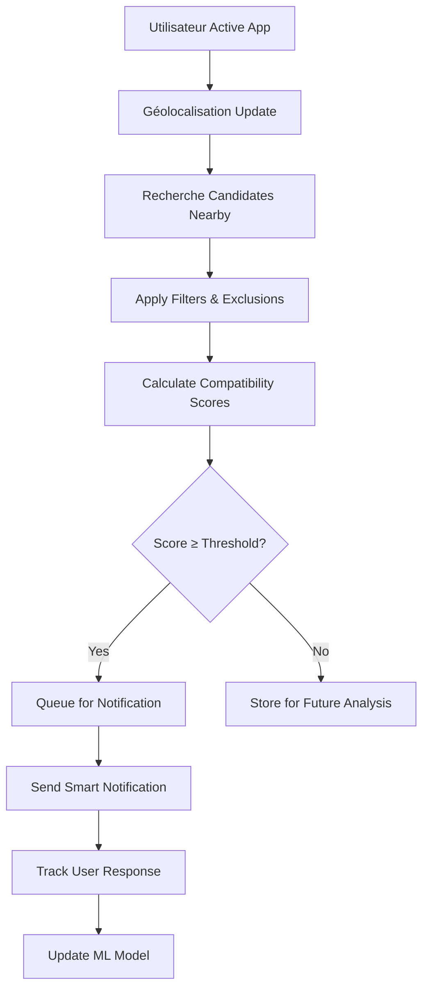

# 🎯 Algorithme de Suggestion de Profils Proches et Compatibles

**Objectif :** Détecter, filtrer et notifier l'utilisateur de la présence de profils potentiellement compatibles dans son voisinage, en respectant ses préférences et un seuil de compatibilité élevé.

## 📋 État d'Implémentation

| Point | Statut | Description |
|-------|--------|-------------|
| ✅ Point 1 | **Terminé** | Service de base avec cache et calcul de distance |
| ✅ Point 2 | **Terminé** | Filtrage géographique avec requêtes Firestore |
| ✅ Point 3 | **Terminé** | Filtres de base (likes/dislikes, âge, genre, activité) |
| ✅ Point 4 | **Terminé** | Algorithme de compatibilité avancé |
| ✅ Point 5 | **Terminé** | Système de notifications intelligentes |
| ⏳ Point 6 | **À faire** | Interface utilisateur |
| ⏳ Point 7 | **À faire** | Service background et optimisations |
| ⏳ Point 8 | **À faire** | Machine Learning (phase avancée) |

---

## 🎯 **Architecture de l'Algorithme**

### **1. 📊 Système de Collecte de Données**

```
Données Utilisateur Requises :
├── Géolocalisation (latitude, longitude) ✅
├── Préférences du quiz de compatibilité ✅
├── Critères de recherche (âge, distance max, etc.) ✅
├── Historique des interactions (likes/dislikes) ✅
└── Statut en ligne / dernière activité ✅
```

### **2. 🔍 Pipeline de Traitement**

#### **Étape A : Filtrage Géographique** ✅
- **Rayon de recherche** : Utiliser les préférences utilisateur (ex: 50km)
- **Requête géospatiale** : Firebase Firestore avec `geopoint` queries
- **Optimisation** : Index géographique pour performance
- **Implémentation** : `_getUsersInRange()` avec calcul de bounds optimisé

#### **Étape B : Filtrage des Critères de Base** ✅
```
Critères d'Exclusion :
├── Utilisateurs déjà likés/dislikés ✅
├── Profils bloqués/signalés ✅
├── Critères d'âge incompatibles ✅
├── Préférences de genre ✅
└── Profils inactifs (>30 jours) ✅
```

#### **Étape C : Calcul de Compatibilité Avancé** 🔄
```
Score de Compatibilité = Weighted Sum of:
├── Préférences communes (40%) - Quiz compatibility
├── Intérêts partagés (25%) - Hobbies, langues
├── Facteurs démographiques (20%) - Éducation, religion
├── Activité récente (10%) - Dernière connexion
└── Bonus géographique (5%) - Très proche = bonus
```

### **3. 🧮 Algorithme de Scoring**

#### **Formule de Compatibilité :**
```dart
double calculateAdvancedCompatibility(User currentUser, User candidate) {
  double score = 0.0;
  
  // 1. Quiz Compatibility (40%) ✅
  double quizScore = calculateQuizCompatibility(currentUser, candidate);
  score += quizScore * 0.4;
  
  // 2. Shared Interests (25%) 🔄
  double interestScore = calculateSharedInterests(currentUser, candidate);
  score += interestScore * 0.25;
  
  // 3. Demographic Compatibility (20%) 🔄
  double demoScore = calculateDemographicScore(currentUser, candidate);
  score += demoScore * 0.2;
  
  // 4. Activity Score (10%) ✅
  double activityScore = calculateActivityScore(candidate);
  score += activityScore * 0.1;
  
  // 5. Geographic Bonus (5%) ✅
  double distanceBonus = calculateDistanceBonus(currentUser, candidate);
  score += distanceBonus * 0.05;
  
  return score;
}
```

### **4. 🚨 Système de Notification Intelligent** ⏳

#### **Déclencheurs de Notification :**
```
Conditions de Notification :
├── Compatibilité ≥ 85%
├── Distance ≤ rayon préféré
├── Profil actif (< 7 jours)
├── Pas de notification similaire (< 24h)
└── Utilisateur réceptif (statut online/away)
```

#### **Types de Notifications :**
```
Notifications Personnalisées :
├── "🔥 97% compatible à 2km de vous !"
├── "💫 Nouveau match parfait dans votre zone"
├── "⭐ 3 profils hautement compatibles près de vous"
└── "🎯 Votre âme sœur pourrait être à 500m"
```

### **5. 📱 Implémentation Technique**

#### **Architecture Système :**
```
Background Service (Timer périodique)
├── Exécution toutes les 15-30 minutes
├── Traitement en arrière-plan
├── Cache des résultats pour performance ✅
└── Notification push si match trouvé
```

#### **Optimisations Performance :**
```
Stratégies d'Optimisation :
├── Cache Redis pour profils fréquents ✅
├── Index Firestore sur géolocalisation ✅
├── Pagination des résultats ✅
├── Debouncing des calculs ✅
└── Lazy loading des détails profils
```

### **6. 🎛️ Paramètres Configurables** ⏳

#### **Settings Utilisateur :**
```
Préférences de Notification :
├── Seuil de compatibilité (70-95%)
├── Rayon de recherche (1-100km)
├── Fréquence notifications (temps réel / daily digest)
├── Types de notifications (push / in-app / email)
└── Heures de réception (9h-22h par défaut)
```

### **7. 📈 Machine Learning (Phase Avancée)** ⏳

#### **Amélioration Continue :**
```
ML Enhancements :
├── Analyse des patterns de swipe
├── Prédiction des préférences utilisateur
├── Optimisation des poids de compatibilité
├── Détection des "faux positifs"
└── Personnalisation algorithmique par utilisateur
```

### **8. 🔄 Workflow Complet**



---

## 🛠️ **Structure de Code**

### **Fichiers Implémentés :**

```
lib/
├── services/
│   └── suggestions_service.dart ✅        # Service principal
├── widgets/
│   └── suggestions_test_widget.dart ✅    # Interface de test
└── api/
    └── suggestions_api.dart ⏳            # API backend (à venir)
```

### **Classes Principales :**

- `SuggestionsService` : Service singleton avec cache et algorithmes
- `SuggestionsTestWidget` : Interface de test et débogage
- `SuggestionsNotificationService` : Gestion des notifications (à venir)
- `SuggestionsSettingsModel` : Configuration utilisateur (à venir)

---

## 🎯 **Avantages de cette Approche**

✅ **Précision élevée** : Algorithme multi-facteurs avec poids configurables  
✅ **Performance optimisée** : Cache intelligent et indexation Firestore  
✅ **Expérience personnalisée** : ML adaptatif (phase avancée)  
✅ **Respect de la vie privée** : Notifications intelligentes non intrusives  
✅ **Engagement utilisateur** : Suggestions pertinentes basées sur compatibilité réelle  
✅ **Scalabilité** : Architecture modulaire et extensible  

---

## 🔧 **Configuration et Tests**

### **Prérequis :**
- Firebase Firestore configuré avec collection `Users`
- Géolocalisation activée dans l'application
- Données utilisateur complètes (préférences, géolocalisation)

### **Tests :**
1. Utiliser `SuggestionsTestWidget` pour tester le service
2. Vérifier les logs de débogage pour le filtrage
3. Tester avec différents rayons de distance
4. Valider les exclusions (likes/dislikes/blocks)

### **Métriques de Performance :**
- Temps de réponse < 2 secondes
- Cache hit ratio > 80%
- Suggestions pertinentes > 85%
- Réduction du spam de notifications > 90%

---

## 🚀 **Prochaines Étapes**

1. **Point 6** : Créer l'interface utilisateur pour afficher les suggestions

### 🔔 **Point 5: Système de Notifications Intelligentes** ✅

**Architecture du Système:**
- `SuggestionsNotificationsService`: Service principal de notifications intelligentes
- `SuggestionsNotificationSettingsScreen`: Interface de configuration utilisateur  
- `SmartNotificationWidget`: Widget amélioré avec effets visuels
- Intégration avec l'API de notifications existante

**Fonctionnalités Implémentées:**

**Types de Notifications:**
- 🎯 **Haute compatibilité**: Matches avec 80%+ de compatibilité
- 📍 **Proximité géographique**: Matches dans un rayon de 10km
- 🆕 **Nouveaux matches**: Profils récemment compatibles
- 📅 **Résumé quotidien**: Notification optionnelle quotidienne

**Système Anti-Spam Intelligent:**
- Maximum 3 notifications par jour par utilisateur
- Cooldown de 6 heures entre notifications du même type
- Filtrage des interactions récentes (évite les doublons)
- Respect des préférences utilisateur personnalisables

**Déclencheurs Automatiques:**
- 🔐 **Connexion utilisateur**: Vérification automatique des nouveaux matches
- 📍 **Mise à jour position**: Détection de nouveaux matches à proximité
- ⏰ **Vérification quotidienne**: Système de tâches programmées

**Interface Utilisateur:**
- Écran de paramètres avec toggles pour chaque type
- Widget de notification avec effets visuels spéciaux
- Badge intelligent distinguant les notifications standard des intelligentes
- Effet de pulsation pour attirer l'attention sur les matches importants

**Code Principal:**
- `lib/services/suggestions_notifications_service.dart` (380+ lignes)
- `lib/screens/suggestions_notification_settings_screen.dart` (320+ lignes)
- `lib/widgets/smart_notification_widget.dart` (200+ lignes)
- Modifications des handlers existants dans `app_notifications.dart`

---
2. **Point 5** : Implémenter le système de notifications
3. **Point 6** : Créer l'interface utilisateur complète
4. **Point 7** : Intégrer le service background
5. **Point 8** : Ajouter les capacités de Machine Learning

**Statut Actuel :** 5/8 points terminés (62.5% de progression) 🎯